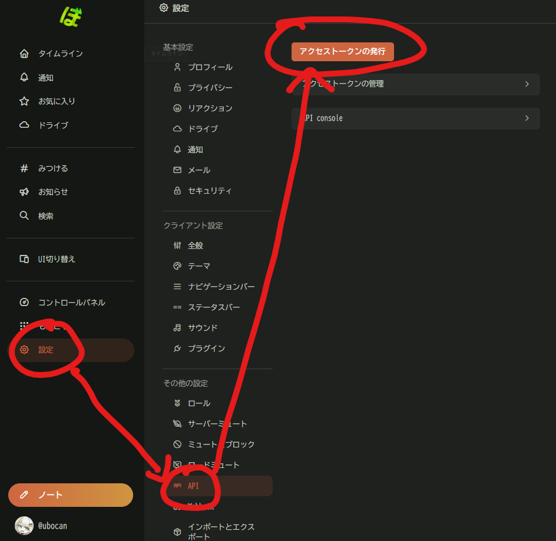
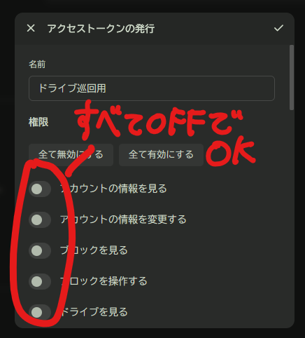
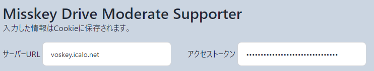
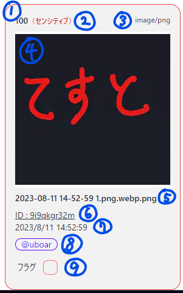
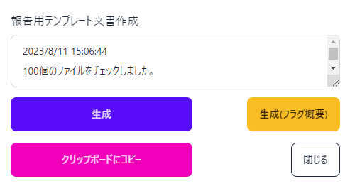

# Misskey Drive Moderate Supporter

## これは何？
Misskey鯖缶・モデレータ向けドライブ巡回支援ツールです。

## 場所
[ここ](https://uboar.github.io/misskey-drive-moderate-supporter)

## 使い方
### 初期セットアップ
1. Misskey側の「`設定→API→アクセストークンの発行`」からアクセストークンを発行する。権限は不要だが発行者がモデレータである必要がある。
   
   
2. 確認コードをコピーする。このコードは二度と表示されないので、忘れたら再度発行する事。また、**このコードはいかなる他人にも絶対に教えてはいけない。**
3. [Webアプリ](https://uboar.github.io/misskey-drive-moderate-supporter)の「`サーバーURL`」に見たいサーバーのURL(`https://`は付けない)、「`アクセストークン`」に2で発行した確認コードを入力。
   
4. `ファイルの取得`ボタンを押すとファイルが取得される事を確認する。

### 主な使い方
#### 各ファイルのプレビュー

1. ファイルの通し番号。
2. ファイルにNSFWフラグが立っている場合、**センシティブ**と表示される。
3. ファイルの種類。
4. ファイルのプレビュー。クリックすると元ファイルのURLに移動する。
5. ファイル名。
6. ファイルID。クリックするとMisskey側の管理画面に移動する。
7. ファイルがアップロードされた日時。
8. ファイルをアップロードしたアカウント名。クリックすると該当アカウントのユーザーページに移動する。
9. ~~バカ~~ファイルに対しフラグを立てる事が出来る。フラグを立てたファイルは一覧にして出力可能。

#### ファイルチェックの流れ
1. `sinceId`にチェックしたい一番古いファイルのIDを入力する。
   - 報告用テンプレから本アプリに遷移した場合、このパラメータは自動で記入されるので、基本的には気にしないでOK
2. `ファイルの取得`から情報を取得し、チェックを行う。
3. チェックしたいファイルが100件以上ある場合、`これより新しいファイルを取得`をクリックする事で、追加で100件づつ取得するファイルを増やす事が出来る。
4. チェックが終了したら、`報告用テンプレート文書作成`→`生成`→`クリップボードにコピー`で報告用のテンプレを作成出来る。
   
5. フラグを立てたファイルがある場合、`生成(フラグ概要)`からフラグを立てたファイルの一覧を出力する事が出来る。